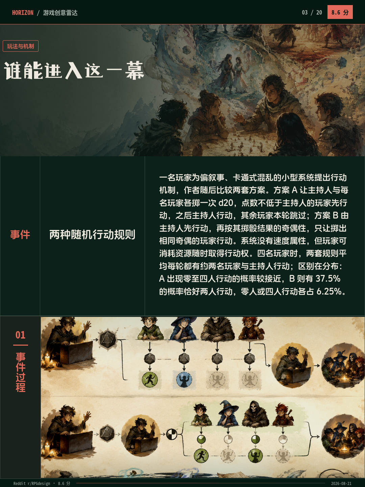
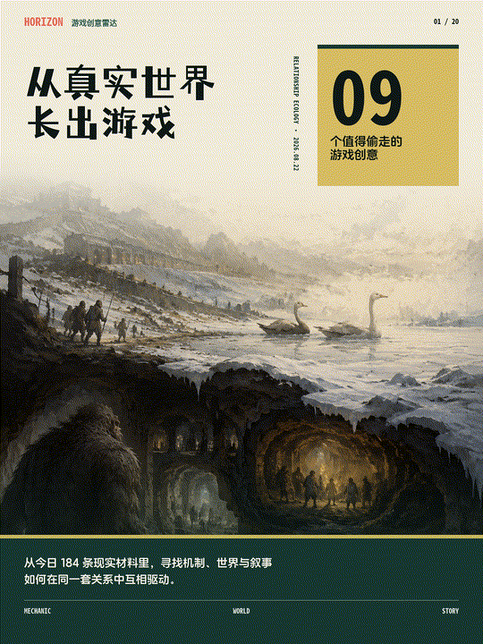

# Horizon - Game Inspiration Radar

Horizon turns live RSS and X/Twitter signals into structured game-design research. It filters noisy sources, runs three reasoning agents, translates the findings into visual mechanisms, and publishes a 22-card Chinese report to Feishu.

`190 sources -> 3 reasoning agents -> 2 visual passes -> 22 report cards -> Feishu`

<div align="center">
  
</div>

<div align="center">
  
</div>

Chinese documentation: [README.md](./README.md)

## What it does

- Aggregates 90 RSS feeds and 100 X/Twitter accounts for the daily source pool.
- Scores, deduplicates, researches, and selects high-signal stories.
- **A1 Fact:** reconstructs a traceable event chain from primary material.
- **A2 Relationships:** maps rules, choices, constraints, and feedback using game-design and experience-engine principles.
- **A3 Systems:** turns the relationship model into questions about feedback, delay, adaptation, emergence, and long-term change, informed by *Thinking in Systems* and Qian Xuesen's open complex giant systems.
- Generates concept and mechanism visuals, then renders Markdown and PNG report cards.
- Orchestrates daily, weekly, and reserve runs with n8n; optionally delivers the result to Feishu.

## Five-minute start

Requirements: Docker Desktop, Docker Compose, and one supported AI API key.

```powershell
Copy-Item .env.example .env
Copy-Item Horizon\.env.example Horizon\.env
docker compose up -d
Invoke-RestMethod http://localhost:8090/healthz
```

Put at least one model key in `Horizon/.env` and point `Horizon/data/config.json` at it through `ai.api_key_env`:

```text
OPENAI_API_KEY=your-key
```

Run a small test before enabling schedules:

```powershell
docker compose --profile manual run --rm horizon --hours 1
```

The test is successful when the command exits normally and `output/game-inspiration-radar-*/` contains `report.md` and `cards/`.

## Optional integrations

- X/Twitter: set `TWITTER_AUTH_TOKEN` (and `APIFY_TOKEN` when using the Apify scraper).
- Reddit: public RSS can be used first; OAuth credentials improve rate limits.
- Feishu: set `FEISHU_APP_ID`, `FEISHU_APP_SECRET`, and `FEISHU_CHAT_ID` only when delivery is needed.
- Image generation: keep `HORIZON_IMAGE_GENERATION_ENABLED=false` during the first run; stable text cards do not require image generation.

## Services

| Service | Purpose | Local address |
| --- | --- | --- |
| RSSHub | Source normalization and RSS routes | `http://localhost:1200` |
| Horizon API | Fetch, scoring, reasoning, reporting, delivery | `http://localhost:8090` |
| n8n | Scheduled and manual orchestration | `http://localhost:5678` |
| Browserless | HTML-to-PNG rendering | internal only |

Import `n8n/workflows/game-tech-daily.json` in n8n for the daily, weekly, and reserve entry points.

## Output

Reports are written to:

```text
output/game-inspiration-radar-<date>-<run-id>/
```

Each run contains Markdown, a cover, a directory/overview page, and report-card PNGs. The full API path is:

```text
/fetch -> /score -> /filter -> /research -> /evaluate
       -> /select -> /enrich -> /report -> /feishu
```

## Troubleshooting

- API unhealthy: inspect `docker compose logs horizon-api`; verify the model key and `ai.api_key_env` match.
- RSSHub unhealthy: inspect `docker compose logs rsshub rsshub-redis` and test `/healthz` on port 1200.
- Image generation errors: set `HORIZON_IMAGE_GENERATION_ENABLED=false` and rerun the text-card path.
- Feishu delivery errors: verify the three `FEISHU_*` variables and bot permissions; delivery can remain disabled for local runs.

## License and upstream

Horizon is built on [Thysrael/Horizon](https://github.com/Thysrael/Horizon), with this repository adding game-inspiration routing, staged reasoning, visual card composition, n8n orchestration, and Feishu delivery.
