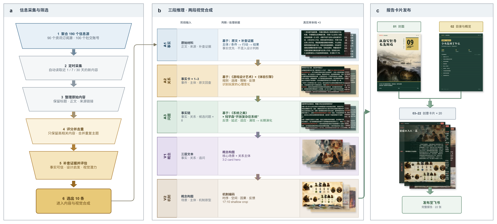

<div align="center">
  <h1>Horizon · 游戏创意雷达</h1>
  <p>从 190 个信息源，到 22 张可读、可复核、可转发的创意报告卡片。</p>
  <p>
    <a href="#工作流">工作流</a> ·
    <a href="#快速开始">快速开始</a> ·
    <a href="#输出">输出</a> ·
    <a href="#安全说明">安全说明</a>
  </p>
</div>

Horizon 面向游戏设计师、策划、XR 创作者和世界观研究者。它持续聚合真实世界的信息，从高噪声素材中筛出值得继续发展的线索，再将事实、关系、系统问题和视觉机制组织成中文报告。

<div align="center">
  
</div>

> **一眼看懂**：采集与筛选 → 三段推理 Agent → 两段视觉合成 → 22 张报告卡片 → 飞书发布

## 工作流

### 1. 信息采集与筛选

日更任务汇集 90 个资讯订阅源和 100 个 X/Twitter 账号，并按统一流程处理：

1. **定时采集**：读取近 1、7 或 30 天的新内容，对应日更、周更和储备池。
2. **整理原始内容**：保留标题、正文和来源链接，形成可追溯的基础材料。
3. **评分并去重**：只保留高相关内容，并合并围绕同一主题的重复信息。
4. **补查证据并评估**：检查事实可信度、设计启发性和视觉潜力。
5. **选出 10 条线索**：进入内容推理与视觉合成阶段。

### 2. 三段推理 Agent

三段 Agent 各自回答不同问题，前一段的结构化结果是后一段的输入：

| Agent | 输入 | 判断与处理依据 | 输出 |
| --- | --- | --- | --- |
| **A1 事实** | 正文、来源、补查证据 | 基于原文和补查证据，按“主体/条件 -> 行动 -> 结果”还原事件；事实优先，不混入设计判断 | 可追溯的事实链 |
| **A2 关系** | A1 事实卡 | 基于《游戏设计艺术》与《体验引擎》，分析规则、选择、限制与反馈，识别玩家如何被置入事件 | 关系结构与体验张力 |
| **A3 问题** | 事实、关系和候选问题 | 基于《系统之美》与钱学森“开放复杂巨系统”思想，检查反馈、延迟、适应、涌现和长期演化 | 可继续探索的系统问题 |

每个 Agent 都保留真实样本栈，便于回看它使用了哪些材料、做出了什么判断，而不是只留下不可核验的最终结论。

### 3. 两段视觉合成

推理结果不会直接套模板，而是经过两段视觉翻译：

| 阶段 | 处理内容 | 视觉结果 |
| --- | --- | --- |
| **V1 概念** | 将事实、关系和追问整理为三层文本，明确核心场景与关系主体 | 3:2 概念主视觉与画面构图 |
| **V2 机制** | 将场景、主体和机制原型编排为空间、时间、因果与反馈 | 17:10 机制图及对应报告素材 |

### 4. 22 张报告卡片

最终报告固定为 22 张：

- **01 封面**：建立栏目识别与当期主题。
- **02 目录与概览**：呈现当期规模、主题分布和阅读入口。
- **03-22 创意卡片 x 20**：10 条线索各生成 2 张卡片，分别承载事实/关系洞察和机制/视觉推演。

输出同时保留 Markdown 报告和 PNG 卡片，可供人工复核、归档或推送至飞书。

## 系统组成

| 服务 | 作用 | 默认地址 |
| --- | --- | --- |
| **RSSHub** | RSS 生成、来源统一接入 | `http://localhost:1200` |
| **Horizon API** | 抓取、评分、研究、推理、报告与飞书分发 | `http://localhost:8090` |
| **n8n** | 日更、周更、储备池和手动任务编排 | `http://localhost:5678` |
| **Browserless** | 把 HTML 报告渲染为 PNG 卡片 | 仅供容器内部调用 |
| **Redis** | RSSHub 缓存 | 仅供容器内部调用 |

核心 API 链路如下：

```text
/fetch -> /score -> /filter -> /research -> /evaluate
       -> /select -> /enrich -> /report -> /feishu
```

## 快速开始

### 环境要求

- Docker Desktop 与 Docker Compose
- PowerShell 7（运行本地辅助脚本时）
- 至少一个可用的 AI 模型 API
- 可选：X/Twitter、Reddit 和飞书应用凭据

### 1. 配置环境变量

```powershell
cd F:\InforDetection
Copy-Item .env.example .env
Copy-Item Horizon\.env.example Horizon\.env
```

按需填写 `.env` 与 `Horizon/.env`。密钥只应保存在本地 `.env`，不要提交到版本库。飞书发布需要：

```text
FEISHU_APP_ID=
FEISHU_APP_SECRET=
FEISHU_CHAT_ID=
```

模型提供方和模型名称在以下文件中配置：

```text
Horizon/data/config.json
Horizon/.env
```

### 2. 启动完整服务

```powershell
cd F:\InforDetection
docker compose up -d
```

检查服务状态：

```powershell
docker compose ps
Invoke-RestMethod http://localhost:8090/healthz
```

### 3. 导入 n8n 工作流

打开 `http://localhost:5678`，导入：

```text
n8n/workflows/game-tech-daily.json
```

工作流包含日更、周更和储备池入口，并依次调用 Horizon 的分阶段 API。建议先手动执行一次，确认模型、来源、渲染和输出目录均可用，再开启定时任务。

### 4. 直接运行 Horizon

无需 n8n 时，可直接执行一次 24 小时窗口任务：

```powershell
F:\InforDetection\run-horizon.ps1 -Hours 24
```

也可以运行 Docker 中的手动任务：

```powershell
docker compose --profile manual run --rm horizon --hours 24
```

## 输出

完整报告默认写入：

```text
output/game-inspiration-radar-<date>-<run-id>/
```

目录中包含 Markdown 正文、封面、目录概览和创意卡片 PNG。Horizon 本身生成的通用摘要位于：

```text
Horizon/data/summaries/
```

## 自动化节奏

| 节奏 | 来源池 | 时间窗口 | 默认触发方式 |
| --- | --- | --- | --- |
| **日更** | 90 RSS + 100 X | 24 小时 | 每日 09:00 |
| **周更** | 130 个来源 | 168 小时 | 周日 10:00 |
| **储备池** | 80 个来源 | 720 小时 | 手动触发 |

来源账号的分类只作为来源元数据；每条内容最终进入哪个主题板块，由 AI 根据标题和正文判断。主题配置位于 `Horizon/topics/`。

## 常用操作

```powershell
# 查看运行状态
docker compose ps

# 查看 API 日志
docker compose logs -f horizon-api

# 查看 RSSHub 日志
docker compose logs -f rsshub

# 查看当前主题列表
Invoke-RestMethod 'http://localhost:8090/topics?cadence=daily'

# 停止服务
docker compose down
```

### 单链接回放

`n8n/workflows/horizon-single-link-replay.json` 用于从已有原始记录重新运行单条链路。它会重新执行评分、研究、富化和报告生成，不复用旧结论，适合验证提示词或渲染改动。

### 心理观察短报

`n8n/workflows/psychology-brief.json` 提供独立的中文心理观察卡片流程，对应 API：

```text
POST http://localhost:8090/psychology-brief
```

该流程强调日常经验和情绪识别，不用于心理诊断。

## 项目结构

```text
InforDetection/
|-- Horizon/                 # 分析、研究、报告和飞书分发核心
|   |-- src/                 # Python 源码与阶段 API
|   |-- data/                # 模型、来源与运行数据
|   |-- profiles/            # 分析配置文件
|   `-- topics/              # 六个内容主题板块
|-- n8n/workflows/           # 可导入的自动化工作流
|-- output/                  # 报告与卡片输出
|-- docs/                    # 部署文档、流程图和图像资源
|-- docker-compose.yml       # 本地完整服务栈
|-- run-horizon.ps1          # 单次运行入口
`-- start-rsshub.ps1         # RSSHub 独立启动入口
```

## 安全说明

- 不要提交 `.env`、访问令牌、Cookie 或私有来源 URL。
- 对外发布前应抽查事实链和补查证据，AI 结果不应替代原始来源。
- 飞书发送是外部发布动作；测试时先关闭自动发送，在报告确认后再启用 `/feishu`。
- `output/` 可能包含尚未公开的研究材料，部署时应限制目录访问权限。

## 上游项目

本项目的聚合与摘要基础来自 [Thysrael/Horizon](https://github.com/Thysrael/Horizon)，并在其上增加了游戏创意主题路由、分阶段推理、视觉卡片合成、n8n 编排和飞书报告发布。
